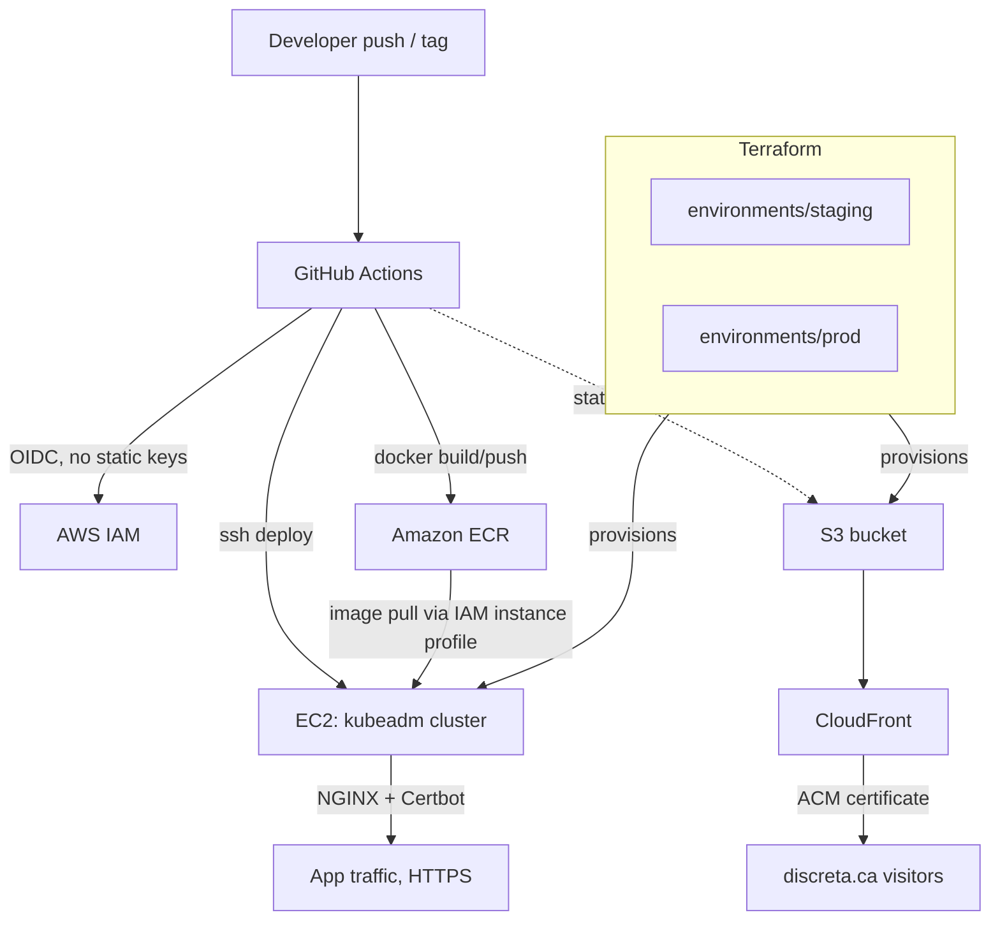

# Discreta

Cloud infrastructure for a real-time location-sharing application, self-hosted on AWS with a self-managed Kubernetes cluster, fully automated CI/CD, and infrastructure-as-code across isolated environments.

> **Note on origin:** Discreta started as a GPS safety-tracking product for real estate agents doing solo showings. After running discovery calls, the product was shelved — the pain wasn't urgent enough to justify a standalone app. The infrastructure was kept and continued as a deliberate portfolio project: a real, working cloud environment rather than a tutorial-scale deployment.

---

## Why this repo is worth reading

Most portfolio projects run on a managed PaaS or a single `docker run`. This one is built the way a cost-conscious team would actually run a small production service on AWS:

- A **self-managed Kubernetes cluster (kubeadm)** on EC2 instead of EKS, to avoid paying for a managed control plane on a low-traffic service
- **OIDC federation** between GitHub Actions and AWS — no long-lived AWS credentials stored anywhere
- **Isolated Terraform state per environment**, so a staging change can never touch production
- Every non-obvious decision below is documented with *why*, not just *what* — including the things that were deliberately **not** built (see [Key Decisions](#key-engineering-decisions--tradeoffs))

---

## Architecture



Two independent surfaces, provisioned separately and deployed separately:

| Surface | Purpose | TLS |
|---|---|---|
| EC2 + kubeadm cluster | The application itself (API + workloads) | NGINX + Certbot (Let's Encrypt), via Porkbun DNS |
| S3 + CloudFront | Static marketing site (discreta.ca) | AWS Certificate Manager (ACM) |

---

## Tech stack

| Layer | Tools |
|---|---|
| Compute | AWS EC2 (Amazon Linux 2023) |
| Orchestration | Kubernetes (kubeadm), containerd |
| Registry | Amazon ECR |
| IaC | Terraform (modular, per-environment state) |
| CI/CD | GitHub Actions, OIDC federation, `appleboy/ssh-action` |
| Networking / TLS | NGINX, Certbot, Porkbun DNS, AWS ACM, CloudFront |
| IAM | Instance profiles, scoped pull policies, `GetAuthorizationToken` |
| Static hosting | S3 + CloudFront (Origin Access Control) |

---

## Key engineering decisions & tradeoffs

The point of this project is judgment, not maximal feature coverage. Every major choice below was made deliberately, and the ones marked *"deferred"* were left out **on purpose** — not because they weren't understood.

| Decision | Why | Tradeoff accepted |
|---|---|---|
| **kubeadm on EC2, not EKS** | Avoids the ~$0.10/hr EKS control-plane fee on a service with near-zero traffic, while still practicing real Kubernetes operations (kubeadm init, containerd, manifests) | I own control-plane upgrades and cluster lifecycle myself — acceptable at this scale, would reconsider at team scale |
| **GitHub Actions OIDC → AWS** | Eliminates long-lived AWS access keys in CI; short-lived, scoped credentials per run | Slightly more setup (trust policy, thumbprint) than a static secret |
| **Isolated Terraform state per environment** | A `terraform apply` in staging can't accidentally touch prod resources | Local state today (see Known Limitations) — no locking yet, which is why it's next on the roadmap |
| **Elastic IP per environment, no ALB/ASG** | Single-instance app doesn't need load balancing yet; an EIP is the FinOps-correct choice at this traffic level | No horizontal scaling or zero-downtime failover — documented as a forward scaling path, not silently ignored |
| **Cron-based ECR credential refresh** | A kubeadm cluster doesn't get EKS's built-in ECR credential provider, so pull tokens expire (12h) without a compensating mechanism | Adds an operational cron job to maintain, instead of "it just works" |
| **Secrets via GitHub Actions `envs`, not SSM Parameter Store** | Simpler to reason about for a solo-maintained repo, faster to set up | Secrets pass through the Actions runner rather than being pulled at deploy time from a secrets manager — a real production system would use SSM/Secrets Manager |
| **Prometheus/Grafana kept as a separate project** | Embedding full observability stack on a zero-traffic demo app would be unjustifiable overhead with nothing to actually monitor | Discreta itself only has basic logging today |

---

## CI/CD pipeline

1. **Build** — GitHub Actions builds the Docker image on every push
2. **Authenticate** — OIDC exchange gets short-lived AWS credentials, no stored keys
3. **Push** — image pushed to ECR, tagged by branch/context:
   - `staging-<git-sha>` for every push to staging
   - `vX.Y.Z` (git tag) for production releases
4. **Deploy** — `appleboy/ssh-action` connects to the target EC2 instance and rolls out the new image to the cluster
5. **Environments** — prod and staging run on **separate EC2 instances**, each with its own key pair and host secrets, so a staging compromise can't reach production

---

## Terraform structure

```
terraform/
├── modules/
│   └── ec2-app/        # reusable EC2 + security group + IAM module
├── environments/
│   ├── staging/         # isolated state, own tfvars
│   └── prod/            # isolated state, own tfvars
└── network/             # shared networking primitives
```

Each environment applies independently — there is no shared state file between staging and prod, which is what makes it safe to iterate on staging without a risk of touching production infrastructure.

---

## IAM chain (EC2 → ECR)

A detail worth knowing cold for interviews, since it's easy to get wrong:

- **Trust policy** on the IAM role allows EC2 to assume it (via instance profile)
- **Permissions policy** separately grants ECR actions
- `ecr:GetAuthorizationToken` requires `Resource: "*"` — it's an account-level token, not scoped to a repo
- Pull actions (`GetDownloadUrlForLayer`, `BatchGetImage`, etc.) **can** be scoped to specific repository ARNs
- The instance profile is what actually attaches the role to the running EC2 instance — a common source of confusion is expecting the role alone to be enough

---

## Repository structure

```
.
├── .github/workflows/   # CI/CD pipeline definitions
├── discreta/            # application source
├── k8s/                 # Kubernetes manifests
├── terraform/           # infrastructure as code (see above)
├── codemagic.yaml        # mobile client build pipeline
└── README.md
```

---

## Known limitations (documented, not hidden)

Being upfront about the current gaps is more useful to a reader than pretending they don't exist:

- **Port 22 is open** on the app EC2 instances — fine for a solo-maintained demo, would be replaced with SSM Session Manager or a bastion in a team setting
- **Local Terraform state** — no remote backend or locking yet; this is a known blocker for any CI/CD path that runs `terraform apply` unattended
- **Secrets pass through GitHub Actions `envs`** rather than being pulled from a secrets manager at deploy time

---

## Roadmap

- [ ] Migrate Terraform state to an S3 remote backend with locking (required before automating `terraform apply`)
- [ ] Scaling path: ALB + ASG, documented as the next step if traffic ever justified it — deliberately not built prematurely
- [ ] Standalone Prometheus/Grafana demo project (kept separate from Discreta so it isn't an unjustified addition to a zero-traffic app)
- [ ] Static site (discreta.ca) via CloudFront + OAC, ACM cert in `us-east-1`, Porkbun ALIAS/ANAME for apex domain

---

## Local development

```bash
# clone
git clone https://github.com/ItsmePatrice/Discreta.git
cd Discreta

# provision an environment
cd terraform/environments/staging
terraform init
terraform plan
terraform apply
```

CI/CD handles application deployment automatically once infrastructure is provisioned — see `.github/workflows/` for the exact pipeline steps.

---

## Contact

Patrice Ammah — [LinkedIn](https://www.linkedin.com/in/patrice-ammah-b288b328a/) · patriceammah@gmail.com
